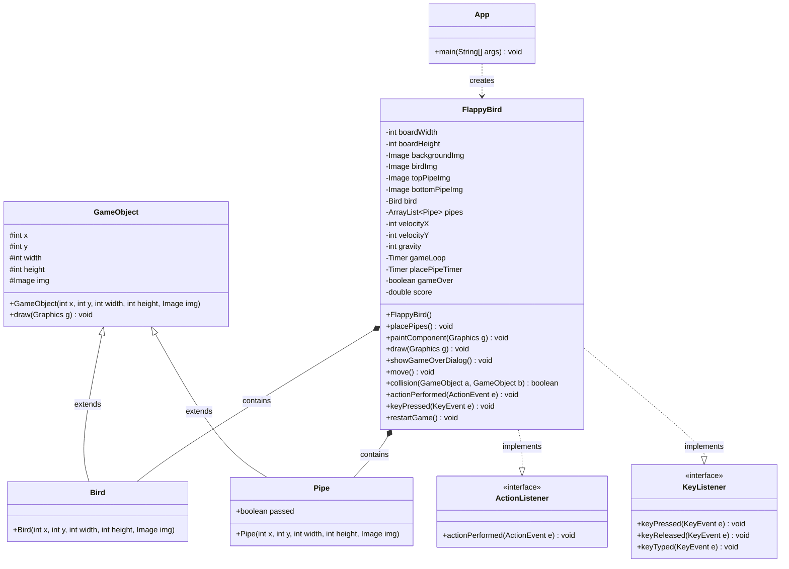

# 🐦 Flappy Bird - Final Project PBO


---

## Deskripsi Proyek

**Flappy Bird** adalah implementasi game klasik yang dikembangkan menggunakan **Java Swing** sebagai Final Project mata kuliah **Pemrograman Berbasis Objek (PBO)**. Game ini menantang pemain untuk mengendalikan seekor burung yang harus melewati serangkaian pipa tanpa menabrak.

### Konsep OOP yang Diterapkan

Proyek ini menerapkan konsep-konsep fundamental Pemrograman Berbasis Objek, antara lain:

1. **Inheritance (Pewarisan)**
   - Kelas `Bird` dan `Pipe` mewarisi dari kelas abstrak `GameObject`
   - Memungkinkan reusability kode untuk properti umum (posisi, ukuran, gambar)

2. **Encapsulation (Enkapsulasi)**
   - Penggunaan modifier akses untuk melindungi data
   - Method-method khusus untuk mengatur logika game

3. **Polymorphism (Polimorfisme)**
   - Implementasi interface `ActionListener` dan `KeyListener`
   - Method `draw()` yang dapat dipanggil pada objek `GameObject` apapun

4. **Abstraction (Abstraksi)**
   - Kelas `GameObject` sebagai blueprint untuk objek-objek game
   - Memisahkan konsep umum dari implementasi spesifik

---

## Rancangan Kelas (Class Diagram)



### Penjelasan Kelas Utama

| Kelas | Tanggung Jawab |
|-------|----------------|
| **GameObject** | Kelas superclass yang menyediakan properti dasar untuk semua objek game (posisi, ukuran, gambar) dan method `draw()` untuk rendering |
| **Bird** | Kelas yang merepresentasikan karakter burung pemain, mewarisi dari `GameObject` |
| **Pipe** | Kelas yang merepresentasikan rintangan pipa, mewarisi dari `GameObject` dan memiliki properti tambahan `passed` untuk tracking skor |
| **FlappyBird** | Kelas utama yang mengatur game loop, rendering, physics, collision detection, dan event handling |
| **App** | Kelas entry point aplikasi yang menginisialisasi JFrame dan memulai game |

---

## Fitur Game

### Gameplay
- **Kontrol Sederhana**: Tekan `SPACE` untuk membuat burung melompat
- **Physics Realistis**: Gravitasi membuat burung jatuh secara natural
- **Difficulty Progresif**: Pipa muncul secara random dengan jarak yang menantang
- **Scoring System**: Skor bertambah setiap berhasil melewati sepasang pipa

### Tampilan

**Tampilan Gameplay Utama**


**Dialog Game Over**


### Fitur Teknis
- **Smooth Animation**: Game loop berjalan pada 60 FPS
- **Collision Detection**: Sistem deteksi tabrakan yang akurat
- **Auto-Respawn**: Pipa baru muncul setiap 1.5 detik
- **Custom Dialog**: Dialog Game Over dengan design yang menarik
- **Restart Functionality**: Kemampuan untuk restart game tanpa menutup aplikasi

---

## Instalasi & Cara Menjalankan

### Prasyarat
- **Java Development Kit (JDK)** 8 atau lebih tinggi
- IDE Java (BlueJ, NetBeans, IntelliJ IDEA, Eclipse, atau VS Code)

### Langkah-langkah Instalasi

1. **Clone Repository**
   ```bash
   git clone https://github.com/indhiraya/Flappy-Bird-FP-PBO.git
   cd Flappy-Bird-FP-PBO
   ```

2. **Pastikan Asset Gambar Ada**
   
   Proyek ini memerlukan file gambar berikut di root directory:
   - `flappybirdbg.png` - Background game
   - `flappybird.png` - Sprite burung
   - `toppipe.png` - Pipa atas
   - `bottompipe.png` - Pipa bawah

3. **Kompilasi & Jalankan**

   **Menggunakan Command Line:**
   ```bash
   # Compile
   javac App.java
   
   # Run
   java App
   ```
   
   **Menggunakan BlueJ:**
   - Buka file `package.bluej`
   - Klik kanan pada class `App`
   - Pilih `void main(String[] args)`

   **Menggunakan IDE Lain:**
   - Buka project di IDE pilihan Anda
   - Jalankan class `App.java`

### Cara Bermain

1. Tekan `SPACE` untuk membuat burung melompat
2. Hindari tabrakan dengan pipa dan tanah
3. Kumpulkan skor sebanyak mungkin
4. Jika Game Over, tekan `Restart` untuk bermain lagi atau `Quit` untuk keluar

---

## Link & Referensi

### Source Code
- **Repository GitHub**: [https://github.com/indhiraya/Flappy-Bird-FP-PBO](https://github.com/indhiraya/Flappy-Bird-FP-PBO)

### Video Demo
> *Link video demo akan ditambahkan di sini*
> 
> **YouTube**: [Masukkan link video demo Anda di sini]

---

## Tim Pengembang

| Nama | Role |
|------|------|
| **Prinka** | Developer |
| **Indhira** | Developer |
| **Akmal** | Developer |

---

<div align="center">

</div>
